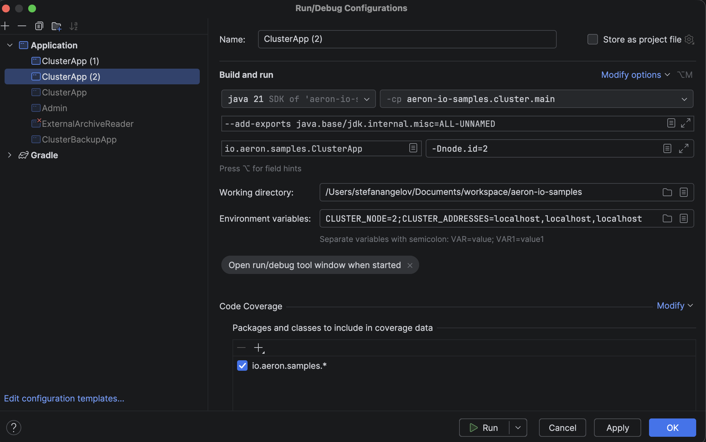

# Running Aeron Cluster Locally

This guide explains how to run the Aeron Cluster and Admin application locally using IntelliJ IDEA for development and testing the `cluster.offer()` implementation.

## Prerequisites

- Java 21 or higher
- Gradle 8.x
- IntelliJ IDEA

## Step 1: Build the Project

Before running the cluster, build the project:

```bash
./gradlew build
```

## Step 2: Configure IntelliJ Run Configurations

The Aeron Cluster requires running **3 nodes** to achieve consensus. You need to create 3 separate run configurations in IntelliJ.

### Creating Run Configurations

1. Open **Run** → **Edit Configurations...**
2. Click **+** → **Application**
3. Create three configurations as shown below

### Configuration for Each Node

For each node (0, 1, 2), configure as follows:

**Common Settings (all nodes):**
- **Main class:** `io.aeron.samples.ClusterApp`
- **Module:** `aeron-io-samples.cluster.main`
- **Working directory:** `/path/to/your/aeron-io-samples` (project root)

**Node 0 Configuration:**
- **Name:** `ClusterApp (0)`
- **Program arguments:** `-Dnode.id=0`
- **Environment variables:** `CLUSTER_NODE=0;CLUSTER_ADDRESSES=localhost,localhost,localhost`

**Node 1 Configuration:**
- **Name:** `ClusterApp (1)`
- **Program arguments:** `-Dnode.id=1`
- **Environment variables:** `CLUSTER_NODE=1;CLUSTER_ADDRESSES=localhost,localhost,localhost`

**Node 2 Configuration:**
- **Name:** `ClusterApp (2)`
- **Program arguments:** `-Dnode.id=2`
- **Environment variables:** `CLUSTER_NODE=2;CLUSTER_ADDRESSES=localhost,localhost,localhost`

### Example Configuration Screenshot

See the configuration example below for Node 2:



**Important Environment Variables:**
- `CLUSTER_NODE` - The node ID (0, 1, or 2)
- `CLUSTER_ADDRESSES` - Comma-separated list of cluster node addresses (use `localhost,localhost,localhost` for local development)

## Step 3: Start the Cluster Nodes

Start all three nodes **in order**:

1. Run `ClusterApp (0)`
2. Run `ClusterApp (1)`
3. Run `ClusterApp (2)`

**Expected output:** You should see log messages indicating cluster formation and leader election. Wait for all nodes to stabilize before proceeding.

## Step 4: Run the Admin Application

Once the cluster is running, start the admin CLI using the provided script:

```bash
cd admin
./run-admin-local.sh
```

This script automatically sets the correct environment variables:
- `CLUSTER_ADDRESSES=localhost,localhost,localhost`
- `RESPONSE_PORT=0` (ephemeral port)

## Step 5: Test the cluster.offer() Implementation

### Connect to the Cluster

In the Admin CLI, type:

```bash
connect
```

You should see a confirmation that the admin is connected to the cluster.

### Create an Auction to Trigger the Notification

Execute the following command:

```bash
add-auction created-by=500 name=Tulips
```

### Expected Log Output

When the `add-auction` command is executed, you should see the following log messages in the **cluster node logs** (the leader node):

```
01:55:05.542 [clustered-service-0-0] INFO  io.aeron.samples.infra.SbeDemuxer - Received CreateAuctionCommand - encoding and submitting AuctionCreatedNotification via cluster.offer
01:55:05.542 [clustered-service-0-0] INFO  io.aeron.samples.infra.SbeDemuxer - Successfully submitted AuctionCreatedNotification via cluster.offer
01:55:05.543 [clustered-service-0-0] INFO  i.a.samples.domain.auctions.Auctions - Creating new auction 'Tulips' with id 2
01:55:05.549 [clustered-service-0-0] INFO  io.aeron.samples.infra.SbeDemuxer - Handling AuctionCreatedNotification: auctionId=2, participantId=500, timestamp=1766102105541, message=CreateAuctionCommand received
```

**What's happening:**
1. `CreateAuctionCommand` is received by `SbeDemuxer`
2. `SbeDemuxer` encodes an `AuctionCreatedNotification` message
3. The notification is submitted via `cluster.offer()` for cluster consensus
4. The cluster processes the message and delivers it back to all nodes
5. `SbeDemuxer` receives and logs the `AuctionCreatedNotification`
6. The auction is created successfully

## Troubleshooting

### Cluster Nodes Not Starting

If nodes fail to start:
1. Check that ports 9000-9200 are not already in use
2. Delete cluster data directories: `rm -rf node0/ node1/ node2/`
3. Restart all nodes

### Admin Cannot Connect

If the admin cannot connect:
1. Verify all 3 cluster nodes are running
2. Check that `CLUSTER_ADDRESSES=localhost,localhost,localhost` is set
3. Review cluster logs for connection errors

### No Log Messages Appearing

If you don't see the expected log messages:
1. Ensure you're creating the auction on the **leader node** (check logs to identify leader)
2. Check logback configuration in `cluster/src/main/resources/logback.xml`
3. Verify the SBE message was successfully compiled during build

## Cleanup

To reset the cluster state:

```bash
# Stop all cluster nodes in IntelliJ
# Then delete data directories
rm -rf node0/ node1/ node2/
```

## Additional Resources

- [Aeron Cluster Documentation](https://github.com/real-logic/aeron/wiki/Cluster-Tutorial)
- [Admin CLI Commands](./admin/readme.md)
- [Cluster Configuration Guide](./cluster/CLUSTER_CONFIGURATION_GUIDE.md)